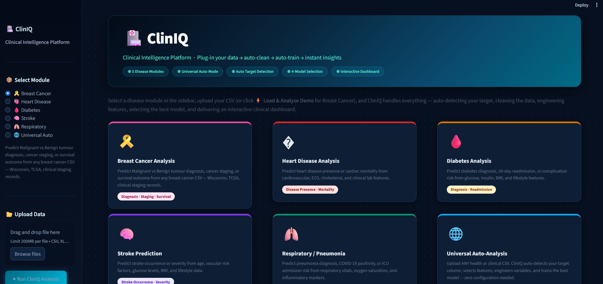
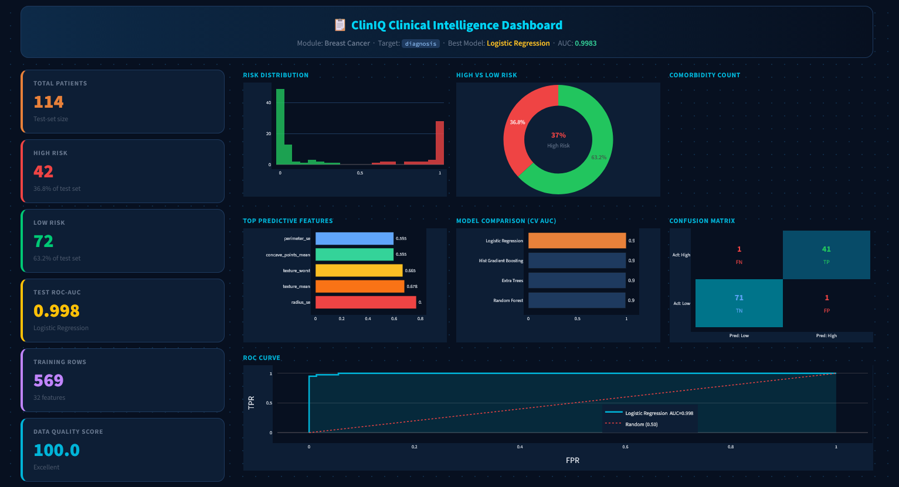
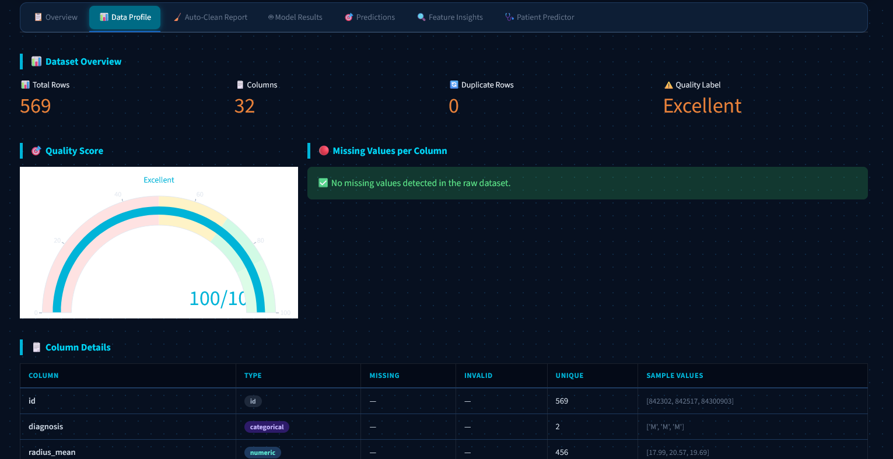
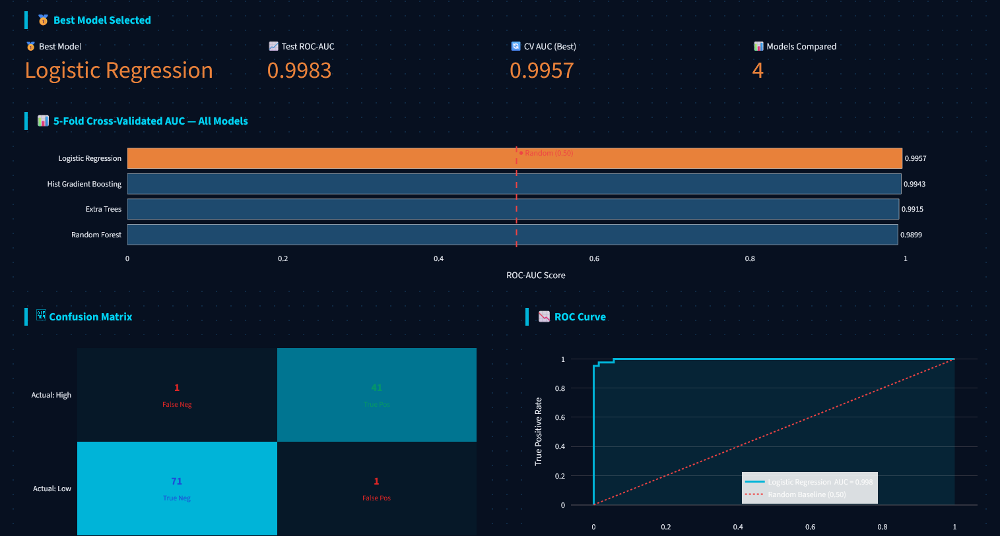
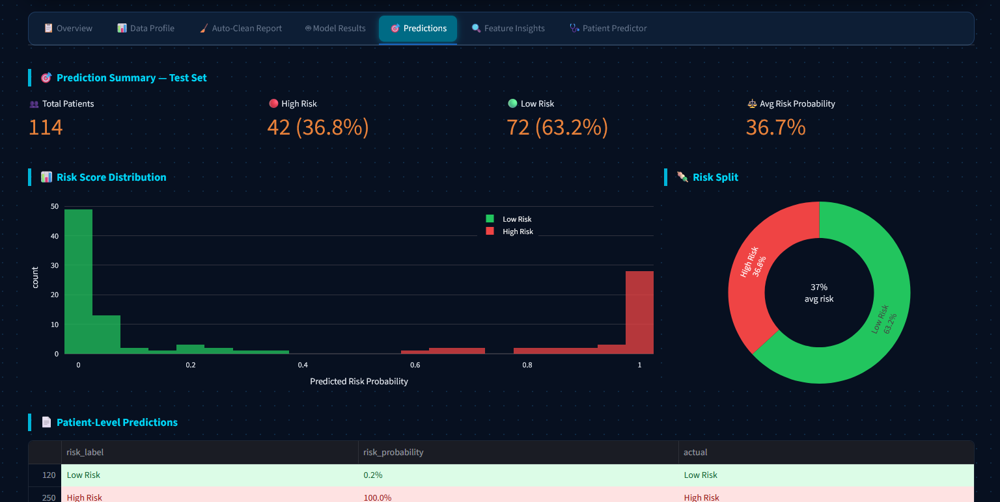
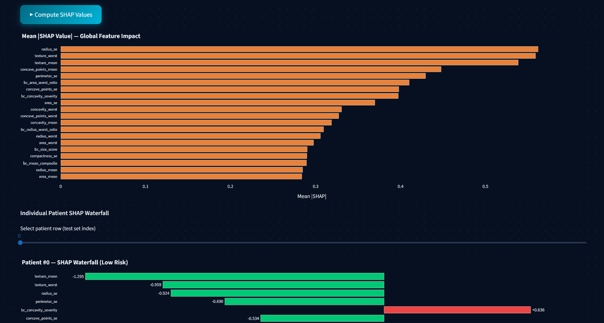
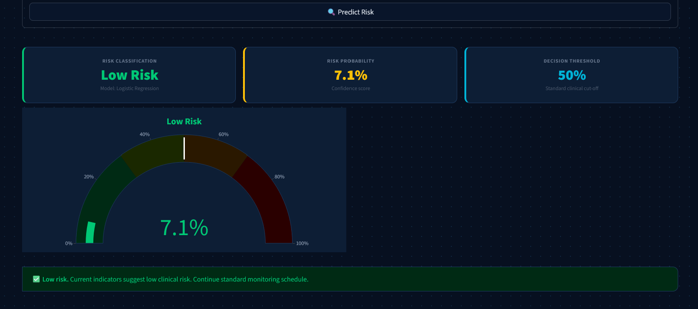

# 🏥 ClinIQ — Clinical Intelligence Platform

> **Plug-in your medical data. Get clinical risk predictions instantly.**

ClinIQ is a production-ready, plug-and-play clinical ML platform built for 5 disease domains + a universal auto-mode. Drop in any structured medical dataset — clean or messy — and the system automatically profiles the data, fixes quality issues, engineers 20+ clinical features, selects the best model via cross-validation, and serves a full interactive dashboard with SHAP explainability and PDF export.

[](https://cliniq1.streamlit.app/)


---

## What Is ClinIQ?

Like plugging in a washing machine — you put in dirty data, you get clean predictions.

**No manual preprocessing. No feature engineering scripts. No model selection loops.**
Just upload your CSV and click **Run**.

```
Upload CSV → Auto-Profile → Auto-Clean → Feature Engineering
                                       → 5-Fold CV Model Selection
                                       → Interactive Dashboard (7 tabs)
                                       → SHAP Explainability + PDF Export
                                       → REST API (FastAPI) + FHIR R4
                                       → MLflow Model Registry
                                       → Docker one-command deploy
```

---

## 5 Disease Modules + Universal Auto-Mode

| Module | Prediction Task | Demo Data |
|---|---|---|
| 🎗️ **Breast Cancer** | Malignant vs Benign tumour | ✅ Wisconsin dataset (569 patients) |
| 🫀 **Heart Disease** | Cardiac event risk | Upload your CSV |
| 🩸 **Diabetes** | Diabetic vs Non-diabetic | Upload your CSV |
| 🧠 **Stroke** | Stroke risk prediction | Upload your CSV |
| 🫁 **Respiratory** | Respiratory disease risk | Upload your CSV |
| 🌐 **Universal Auto** | Any binary clinical target | Any CSV — zero config |

> **Try it instantly:** Select **Breast Cancer** and click **⚡ Load & Analyse Demo** — no upload needed.

---

## Quickstart

### 1. Clone the repository
```bash
git clone https://github.com/Najam0786/-ClinIQ.git
cd -ClinIQ
```

### 2. Create and activate a virtual environment
```bash
python -m venv venv

# Windows
venv\Scripts\activate

# macOS / Linux
source venv/bin/activate
```

### 3. Install dependencies
```bash
pip install -r requirements.txt
```

### 4a. Launch the Streamlit dashboard
```bash
streamlit run app.py
```
Open [http://localhost:8501](http://localhost:8501)

### 4b. Launch the REST API (optional)
```bash
uvicorn api.main:app --reload --port 8000
```
Swagger UI: [http://localhost:8000/docs](http://localhost:8000/docs)

### 4c. One-command full stack (Docker)
```bash
docker-compose up --build
```
Starts: Streamlit `:8501` · FastAPI `:8000` · MLflow `:5000`

---

## How to Use

1. **Select a disease module** in the sidebar
2. **Upload your CSV or Excel file** — or click **⚡ Load & Analyse Demo** (Breast Cancer)
3. ClinIQ **auto-detects your target column** (override if needed)
4. Click **▶ Run ClinIQ Analysis** — everything else is automatic

### What ClinIQ Does Automatically

| Step | What Happens |
|---|---|
| **Profile** | Detects column types, missing values, duplicates, invalid values; computes a 0–100 quality score |
| **Clean** | Removes duplicates, replaces impossible negatives with NaN, imputes with median/mode |
| **Engineer** | Builds 20+ clinical features: age groups, BMI categories, BP flags, polypharmacy, lab abnormality flags, comorbidity counts |
| **Train** | Runs 5-fold CV on Random Forest, Logistic Regression, Gradient Boosting, and HistGradientBoosting; selects best by AUC |
| **Evaluate** | ROC curve, confusion matrix, per-class classification report on held-out test set |
| **Explain** | SHAP waterfall plots + feature importance ranked bar chart |
| **Export** | One-click PDF report with all results |

---

## Machine Learning Models

### Candidate Models — Auto-Selected by 5-Fold Cross-Validation

ClinIQ trains **4 models in parallel** on every run. The one with the highest mean CV AUC is automatically chosen as the winner.

| Model | Type | Strengths in Clinical Data |
|---|---|---|
| 🌲 **Random Forest** | Ensemble (bagging) | Handles mixed feature types, robust to outliers, built-in feature importance |
| 📈 **Logistic Regression** | Linear | Fast, interpretable coefficients, strong baseline for well-engineered features |
| 🚀 **Gradient Boosting** | Ensemble (boosting) | High accuracy on structured tabular data, captures non-linear interactions |
| ⚡ **HistGradientBoosting** | Ensemble (boosting) | Native missing-value handling, fast on large datasets (>10k rows) |

---

### Model Selection Pipeline

```
Raw Features
     │
     ▼
┌──────────────────────────────────────────┐
│  Preprocessing (ColumnTransformer)        │
│  • Numeric  → Median imputation + StandardScaler  │
│  • Categorical → Most-frequent imputation + OneHotEncoder │
└──────────────┬───────────────────────────┘
               │
               ▼
┌──────────────────────────────────────────┐
│  5-Fold Stratified Cross-Validation       │
│  All 4 models evaluated in parallel       │
│  Metric: ROC-AUC (handles class imbalance)│
└──────────────┬───────────────────────────┘
               │
               ▼
      Best model by mean CV AUC
               │
               ▼
┌──────────────────────────────────────────┐
│  Final Training on full train set         │
│  Evaluation on held-out test set (20%)    │
└──────────────────────────────────────────┘
```

---

### Evaluation Metrics

| Metric | Description | Why It Matters Clinically |
|---|---|---|
| **ROC-AUC** | Area under the ROC curve | Primary selection metric — works well with imbalanced classes |
| **Precision** | TP / (TP + FP) | How many flagged high-risk patients are truly high risk |
| **Recall (Sensitivity)** | TP / (TP + FN) | How many true high-risk patients are correctly caught |
| **F1-Score** | Harmonic mean of precision & recall | Balance between missing cases and false alarms |
| **Confusion Matrix** | TN / FP / FN / TP breakdown | Direct view of misclassification types |
| **Classification Report** | Per-class precision, recall, F1 | Full breakdown for both risk classes |

---

### Adaptive Complexity for Large Datasets

To prevent excessive training times on large datasets, ClinIQ **automatically reduces model complexity**:

| Dataset Size | Trees (RF/GBM) | CV Folds | Behaviour |
|---|---|---|---|
| < 5,000 rows | 300 | 5 | Full complexity |
| 5,000 – 20,000 rows | 150 | 3 | Reduced trees |
| > 20,000 rows | 100 | 3 | Minimal trees, fastest training |

---

### Feature Engineering (20+ Auto-Built Features)

Before model training, ClinIQ auto-engineers clinical features from raw columns:

| Feature | Source Columns | Clinical Meaning |
|---|---|---|
| `age_group` | `age` | Paediatric / Adult / Elderly risk bands |
| `bmi_category` | `bmi` | Underweight / Normal / Overweight / Obese |
| `hypertension_stage` | `systolic_bp`, `diastolic_bp` | BP severity staging |
| `hyperglycaemia` | `avg_glucose` | Flag: glucose > 126 mg/dL |
| `poor_glycaemic_control` | `avg_hba1c` | Flag: HbA1c > 7.0% |
| `anaemia` | `avg_hemoglobin` | Flag: haemoglobin below normal |
| `high_cholesterol` | `avg_cholesterol` | Flag: total cholesterol > 200 mg/dL |
| `polypharmacy` | `n_meds` | Flag: taking ≥ 5 medications |
| `high_utilisation` | `n_visits` | Flag: ≥ 5 clinical visits |
| `comorbidity_count` | disease flags | Number of co-existing chronic conditions |
| `low_adherence` | `med_adherence_score` | Flag: adherence score < 0.70 |

---

## 🏭 Production Architecture

ClinIQ ships as a **full production stack** — Streamlit dashboard + REST API + MLflow + FHIR, all containerised with Docker.

```
┌─────────────────────────────────────────────────────────────────┐
│                     ClinIQ Production Stack                      │
├──────────────────┬──────────────────┬───────────────────────────┤
│  Streamlit UI    │  FastAPI REST    │  MLflow Tracking          │
│  :8501           │  :8000           │  :5000                    │
│  cliniq1.        │  /api/v1/        │  Experiment logs          │
│  streamlit.app   │  analyse         │  Model registry           │
│                  │  predict         │  Run comparison           │
│                  │  models          │                           │
│                  │  fhir/predict    │                           │
└──────────────────┴──────────────────┴───────────────────────────┘
         Shared: models/ (joblib) + mlruns/ (MLflow artifacts)
```

### REST API Endpoints

| Method | Endpoint | Description |
|---|---|---|
| `GET` | `/api/v1/health` | API status + model count |
| `POST` | `/api/v1/auth/register` | Create account (doctor / admin / viewer) |
| `POST` | `/api/v1/auth/login` | Login → JWT Bearer token |
| `GET` | `/api/v1/auth/me` | Current user profile |
| `GET` | `/api/v1/auth/users` | List all users (admin only) |
| `POST` | `/api/v1/analyse` | Upload 1–N CSVs → auto-join → full pipeline → trained model |
| `POST` | `/api/v1/predict` | Single-patient prediction (logged to DB if authenticated) |
| `GET` | `/api/v1/models` | List all trained models in registry |
| `GET` | `/api/v1/models/{id}` | Get metadata for a specific model |
| `POST` | `/api/v1/fhir/predict` | FHIR R4 Patient + Observations → RiskAssessment |
| `GET` | `/api/v1/audit` | Full audit trail (admin only) |
| `GET` | `/api/v1/audit/me/predictions` | Current user's prediction history |
| `POST` | `/api/v1/drift/baseline/{disease}` | Upload CSV to set drift baseline |
| `POST` | `/api/v1/drift/detect/{disease}` | Upload new data → KS/Chi² drift report |
| `GET` | `/api/v1/drift/report/{disease}` | Latest drift report for a disease |
| `GET` | `/api/v1/drift/status` | All diseases with baselines + last alert |
| `POST` | `/api/v1/retrain/{disease}` | Manually trigger retrain (doctor+) |
| `POST` | `/api/v1/retrain/{disease}/from-csv` | Retrain on a fresh uploaded CSV |
| `GET` | `/api/v1/retrain/{disease}/status` | Job status (queued / running / completed / failed) |
| `GET` | `/api/v1/retrain/jobs` | All retrain jobs across disease models |
| `GET` | `/api/v1/hospital/me` | Current user's hospital aggregate stats |
| `GET` | `/api/v1/hospital/{hospital}/users` | All users in a hospital (admin only) |
| `GET` | `/api/v1/hospital/{hospital}/stats` | Predictions & risk summary for a hospital (admin only) |

Interactive docs: `http://localhost:8000/docs` (Swagger UI auto-generated)

### One-Command Deployment (Docker)

```bash
docker-compose up --build
```

| Service | URL | Description |
|---|---|---|
| Streamlit Dashboard | http://localhost:8501 | Interactive clinical UI |
| FastAPI REST API | http://localhost:8000/docs | Swagger UI + all endpoints |
| MLflow Tracking | http://localhost:5000 | Experiment logs + model registry |

### Quick API Usage

```bash
# 1. Train a model on your dataset
curl -X POST http://localhost:8000/api/v1/analyse \
  -F "file=@my_patients.csv" \
  -F "disease=heart_disease"

# 2. Predict risk for a single patient
curl -X POST http://localhost:8000/api/v1/predict \
  -H "Content-Type: application/json" \
  -d '{
    "disease": "heart_disease",
    "patient": {"age": 58, "bmi": 29.1, "systolic_bp": 145, "avg_cholesterol": 220}
  }'

# 3. FHIR R4 prediction (NHS/EMR integration)
curl -X POST http://localhost:8000/api/v1/fhir/predict \
  -H "Content-Type: application/json" \
  -d '{
    "disease": "diabetes",
    "patient": {"resourceType": "Patient", "id": "P001", "gender": "female"},
    "observations": [
      {"resourceType": "Observation",
       "code": {"coding": [{"system": "http://loinc.org", "code": "4548-4"}]},
       "valueQuantity": {"value": 7.2, "unit": "%"}}
    ]
  }'
```

### MLflow Model Registry

Every training run is automatically logged:
- ✅ Best model name + all CV AUC scores
- ✅ Test AUC, dataset size, feature count
- ✅ Disease tag for filtering
- ✅ Model artifact registered in MLflow registry

```bash
# Launch MLflow UI locally
mlflow ui --port 5000
```

---

## Dashboard Tabs

| Tab | Contents |
|---|---|
| 📋 **Overview** | KPI cards, risk distribution, model comparison, ROC curve — all at a glance |
| 📊 **Data Profile** | Column summary table, missing value chart, quality score gauge |
| 🧹 **Auto-Clean Report** | Cleaning action log, cells-fixed-per-column chart |
| 🤖 **Model Results** | CV AUC comparison, confusion matrix, ROC curve, classification report |
| 🎯 **Predictions** | Per-patient risk scores with colour-coding, downloadable CSV |
| 🔍 **Feature Insights** | Top-5 driver cards, top-20 importance chart, SHAP explainability, clinical interpretation guide |
| 🩺 **Patient Predictor** | Real-time single-patient risk form → probability gauge + clinical recommendation |
| 📡 **Data Drift** | Drift status table, per-feature KS/Chi² bar chart, live CSV upload check |

---

## Screenshots

### 🏥 Main Dashboard — Landing Page

*ClinIQ home screen — select a disease module, upload your data, and launch the analysis.*

### 📋 Overview Dashboard

*KPI cards, risk distribution donut, model comparison leaderboard, and ROC curve — all in one view.*

### 📊 Data Profile

*Automated data quality scoring, missing value visualisation, and column-level statistics.*

### 🤖 Model Results

*5-fold CV AUC leaderboard, confusion matrix heatmap, and full classification report.*

### 🎯 Predictions

*Per-patient risk scores with colour-coded High / Low risk labels and downloadable CSV.*

### 🔮 SHAP Explainability

*Global mean |SHAP| summary + individual patient waterfall — exactly why the model made each decision.*

### 🩺 Patient Predictor

*Dynamic clinical form + real-time risk gauge + colour-coded clinical recommendation.*

---

## Project Structure

```
ClinIQ/
├── app.py                          ← Streamlit dashboard (main entry point)
│
├── core/
│   ├── profiler.py                 ← Auto-detect schema, types, quality issues
│   ├── cleaner.py                  ← Auto-impute, dedup, fix invalid values
│   ├── feature_engine.py           ← 20+ clinical feature engineering functions
│   └── model_selector.py           ← 4-model CV selection + SHAP support
│
├── modules/
│   ├── breast_cancer.py            ← Wisconsin diagnostic pipeline
│   ├── heart_disease.py            ← Cardiac risk pipeline
│   ├── diabetes.py                 ← Diabetes prediction pipeline
│   ├── stroke.py                   ← Stroke risk pipeline
│   ├── respiratory.py              ← Respiratory disease pipeline
│   └── universal.py                ← Zero-config fallback for any CSV
│
├── sample_data/
│   ├── breast_cancer/
│   │   └── breast_cancer_wisconsin.csv   ← 569 patients, 32 features
│   ├── heart_disease/
│   ├── diabetes/
│   ├── stroke/
│   └── respiratory/
│
├── api/                            ← FastAPI REST layer
│   ├── main.py                     ← FastAPI app + Swagger UI
│   ├── schemas.py                  ← Pydantic request/response models
│   ├── dependencies.py             ← Model store (save/load pipelines)
│   └── routes/
│       ├── health.py               ← GET /api/v1/health
│       ├── analyse.py              ← POST /api/v1/analyse (CSV → pipeline)
│       ├── predict.py              ← POST /api/v1/predict (single patient)
│       ├── models_info.py          ← GET /api/v1/models
│       └── fhir.py                 ← POST /api/v1/fhir/predict (FHIR R4)
│
├── db/                             ← Database layer
│   ├── database.py                 ← SQLAlchemy engine + session (SQLite/PostgreSQL)
│   └── models.py                   ← ORM models: User, PredictionLog, AuditLog
│
├── alembic/                        ← Database migration scripts
│   ├── env.py                      ← Reads DATABASE_URL from env, targets db.models.Base
│   └── versions/
│       └── a62d1d81b6a4_*.py       ← Initial schema migration
├── alembic.ini                     ← Alembic config (URL overridden by env var)
├── MIGRATIONS.md                   ← Migration cheatsheet & revision history
│
├── drift_reports/                  ← Per-disease drift baselines + reports
│   └── {disease}/
│       ├── baseline.parquet        ← Training data snapshot (auto-saved on /analyse)
│       └── latest_report.json      ← Most recent drift detection result
│
├── models/                         ← Saved trained pipelines (joblib)
├── mlruns/                         ← MLflow experiment tracking data
├── screenshots/                    ← Dashboard screenshots for README
│
├── .github/workflows/
│   ├── ci.yml                      ← Quality gate (syntax + pytest) on every push
│   ├── cd.yml                      ← Auto-tag versioned release on main push
│   └── rollback.yml                ← One-click rollback to any previous release
│
├── Dockerfile                      ← Streamlit container
├── Dockerfile.api                  ← FastAPI container
├── docker-compose.yml              ← Full stack: Streamlit + API + MLflow
├── .dockerignore
├── requirements.txt
├── .gitignore
├── ROLLBACK.md                     ← Rollback & recovery guide
└── README.md
```

---

## Bring Your Own Data

ClinIQ works with any structured medical CSV or Excel file.

| Requirement | Detail |
|---|---|
| **Format** | CSV or Excel (`.csv`, `.xls`, `.xlsx`) |
| **Rows** | Minimum ~200 rows for reliable model training |
| **Target column** | Must be binary (0/1 or two distinct class labels) |
| **Missing values** | Handled automatically — no pre-cleaning needed |
| **Column names** | Any names — ClinIQ auto-maps known clinical variables |

**Clinical variables auto-recognised and enriched:**
`age`, `bmi`, `systolic_bp`, `diastolic_bp`, `avg_glucose`, `avg_hba1c`,
`avg_cholesterol`, `avg_hemoglobin`, `avg_creatinine`, `n_meds`, `n_visits`,
`med_adherence_score`, `hospitalizations_6m`, `prev_admissions_12m`, and more.

---

## Tech Stack

### Dashboard
| Library | Role |
|---|---|
| `streamlit` | Interactive 7-tab clinical dashboard |
| `plotly` | Interactive charts (ROC, confusion matrix, SHAP waterfall) |
| `fpdf2` | One-click PDF clinical report export |

### Machine Learning
| Library | Role |
|---|---|
| `scikit-learn` | Preprocessing pipeline, 4 candidate models, all metrics |
| `shap` | SHAP explainability — global summary + per-patient waterfall |
| `pandas` / `numpy` | Data manipulation and feature engineering |
| `scipy` | Statistical utilities |
| `joblib` | Model serialisation for REST API |

### Production API & Infrastructure
| Library | Role |
|---|---|
| `fastapi` | REST API with auto-generated Swagger UI |
| `uvicorn` | ASGI server for FastAPI |
| `pydantic` | Request/response validation and schemas |
| `mlflow` | Experiment tracking + model registry |
| `fhir.resources` | FHIR R4 data models for NHS/EMR integration |
| `openpyxl` / `xlrd` | Excel file support |

### DevOps
| Tool | Role |
|---|---|
| Docker + Docker Compose | Full-stack containerisation |
| GitHub Actions | CI quality gate + CD auto-tagging + rollback |
| Streamlit Community Cloud | Live deployment ([cliniq1.streamlit.app](https://cliniq1.streamlit.app/)) |

---

## Roadmap

### ✅ Completed
- [x] 5-disease specialist modules (Breast Cancer, Heart, Diabetes, Stroke, Respiratory)
- [x] Universal auto-mode for any binary CSV
- [x] Auto target detection with confidence scoring
- [x] Adaptive model complexity for large datasets
- [x] SHAP explainability (global summary + per-patient waterfall)
- [x] PDF report export (one-click downloadable clinical report)
- [x] Single patient real-time predictor (live risk form + gauge)
- [x] CI/CD pipeline with GitHub Actions (quality gate + auto-tag + rollback)
- [x] FastAPI REST layer with Swagger UI
- [x] Docker containerisation (Streamlit + FastAPI + MLflow + PostgreSQL)
- [x] MLflow model registry (auto-log every training run)
- [x] FHIR R4 integration (LOINC-mapped RiskAssessment endpoint)
- [x] JWT authentication (register / login / role-based access: admin / doctor / viewer)
- [x] PostgreSQL database with full audit trail (User, PredictionLog, AuditLog tables)
- [x] Data drift detection (KS-test + Chi² per feature — alert at 30%, critical at 50%)
- [x] Alembic migrations (`alembic upgrade head` on every deploy — PostgreSQL schema versioning)
- [x] Automated model retraining (FastAPI BackgroundTask — auto-triggered at drift_ratio ≥ 0.5)
- [x] Multi-file upload (`/analyse` accepts N CSVs — auto-joined on shared key, concat fallback)
- [x] Streamlit drift dashboard (Tab 7 — live upload, KS/Chi² bar chart, alert badges)
- [x] Multi-tenant hospital support (hospital-scoped users, predictions, aggregate stats)
- [x] Kubernetes deployment (`k8s/` — Namespace, ConfigMap, Deployments, Services, HPA, Ingress)
- [x] Streamlit Community Cloud deployment ([cliniq1.streamlit.app](https://cliniq1.streamlit.app/))

---

## Author

**Nazmul Farooquee**
*Data Scientist*

[](https://www.linkedin.com/in/nazmul-farooquee-mba-0b433b1b/)

Built as a showcase of production-grade clinical ML engineering.
Designed for hospitals, clinics, and health-tech teams who need fast,
interpretable risk predictions without months of data science setup.
